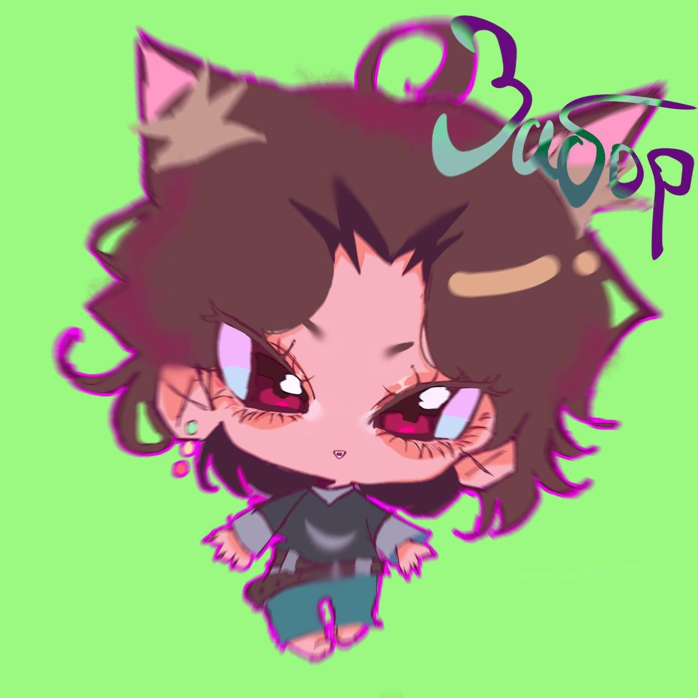

<div align="center">



# Архив «Гостинной»

Фото и арты из чата **«Гостинная»** канала **«Хата охраняемая Забором»**.

Небольшой отфильтрованный архив картинок, мемов, артов, зарисовок и прочего визуального наследия чата.

</div>

---

## Что это

Это публичная подборка изображений из чата **«Гостинная»**.

Архив собран не как официальный музей, а скорее как аккуратная коробка воспоминаний:  
чтобы не потерялось, чтобы можно было переслать, пересмотреть, посмеяться и вспомнить, что тут вообще происходило.

Внутри лежат только отобранные изображения.  
Технические данные экспорта, сообщения и лишняя metadata не публикуются.

---

## Содержимое

Примерная структура архива:

```text
.
├── Arts/
├── Zabor/
├── Gartic|Doodles/
├── Cringe/
└── cover.jpg

---

##Категории

Arts — арты, рисунки, персонажи, визуальные работы.
Zabor — материалы, связанные с Забором и около-заборной культурой.
Gartic|Doodles — Gartic, дудлы, быстрые зарисовки и хаотичные шедевры.
Cringe — отдельная зона культурного ущерба.

---

##Скачать архив

Актуальная версия архива будет лежать в разделе Releases этого репозитория.

Если тебе нужен просто ZIP без клонирования репозитория — смотри Releases.

---

##Будущий сайт

Позже для этого архива планируется отдельный сайт-коллаж.
Он будет в другом репозитории, чтобы сам архив и сайт не мешали друг другу.

---

##Важно

Архив собран для участников и памяти чата.

Если здесь есть твоя работа и ты хочешь:

подписать авторство;
поменять категорию;
убрать изображение;
заменить файл на более качественную версию;

напиши мне в Telegram — поправлю.

---

##Статус

Архив отфильтрован и готов к публикации.
Дальше возможны:

дозагрузка новых изображений;
чистка дублей;
подписи авторов;
отдельный сайт-коллаж;
более удобная навигация по категориям.

---

<div align="center">

Гостинная сохранена. Забор стоит.

</div> ```